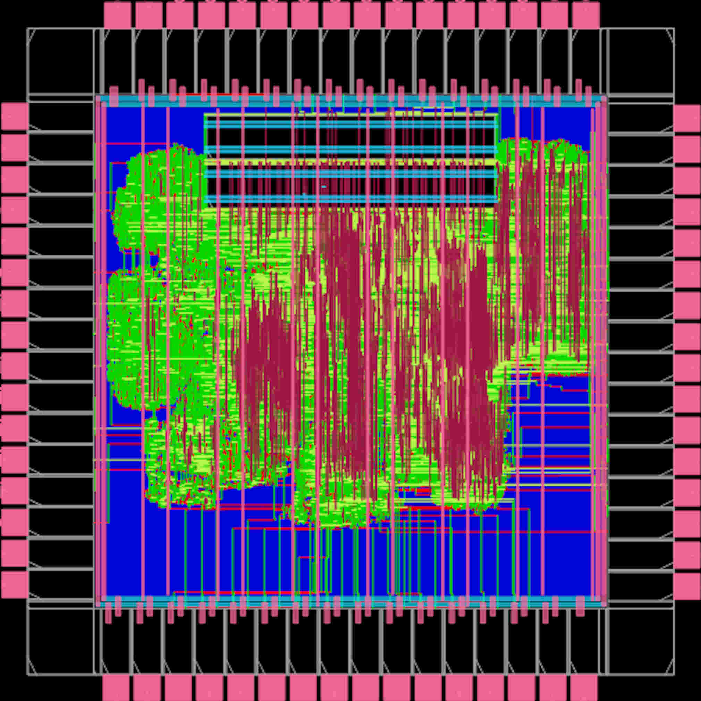

# Moloch

It is a SoC based on Croc (for more information: github.com/pulp-platform/croc), enhanced with a new feature: a hardware accelerator for SHA-256. This addition is particularly useful for ensuring data integrity, especially considering the increasing volume of sensitive data transmissions and the growing demand for heterogeneous System-on-Chips, which make the integration of a cryptographic accelerator for the Secure Hash Algorithm 256 (SHA-256) in Croc essential.

## Architecture

The main difference in the architecture compared to Croc is the SHA-256 accelerator, which is directly connected to the OBI bus. This connection allows it to communicate efficiently with CVE2, the RISC-V core of the SoC.

## Configuration

The main SoC configurations are in `rtl/croc_pkg.sv`:

| Parameter           | Default          | Function                                              |
|---------------------|------------------|-------------------------------------------------------|
| `HartId`            | `0`              | Core's Hart ID                                        |
| `PulpJtagIdCode`    | `32'hED9_C0C50`  | Debug module ID code                                  |
| `NumExternalIrqs`   | `4`              | Number of external interrupts into Croc domain        |
| `BankNumWords`      | `512`            | Number of 32bit words in a memory bank                |
| `NumSramBanks`      | `2`              | Number of memory banks                                |

The SRAMs are instantiated via a technology wrapper called `tc_sram` (tc: tech_cells), the technology-independent implementation is in `rtl/tech_cells_generic/tc_sram.sv`. A number of SRAM configurations are implemented using IHP130 SRAM memories in `ihp13/tc_sram.sv`. If an unimplemented SRAM configuration is instantiated it will result in a `tc_sram_blackbox` module which can then be easily identified from the synthesis results.

## Memory Map

If possible, the memory map should remain compatible with [Cheshire's memory map](https://pulp-platform.github.io/cheshire/um/arch/#memory-map).  
Further each new subordinate should occupy multiples of 4KB of the address space (`32'h0000_1000`).

The address map of the default configuration is as follows:

| Start Address   | Stop Address    | Description                                |
|-----------------|-----------------|--------------------------------------------|
| `32'h0000_0000` | `32'h0004_0000` | Debug module (JTAG)                        |
| `32'h0300_0000` | `32'h0300_1000` | SoC control/info registers                 |
| `32'h0300_2000` | `32'h0300_3000` | UART peripheral                            |
| `32'h0300_5000` | `32'h0300_6000` | GPIO peripheral                            |
| `32'h0300_A000` | `32'h0300_B000` | Timer peripheral                           |
| `32'h1000_0000` | `+SRAM_SIZE`    | Memory banks (SRAM)                        |
| `32'h2000_0000` | `32'h8000_0000` | Passthrough to user domain                 |
| `32'h2000_0000` | `32'h2000_1000` | reserved for string formatted user ROM*    |

*If people modify Croc we suggest they add a ROM at this address containing additional information 
like the names of the developers, a project link or similar. This can then be written out via UART.  
We ask people to format the ROM like a C string with zero termination and using ASCII encoding if feasible.  
The [MLEM user ROM](https://github.com/pulp-platform/croc/blob/mlem-tapeout/rtl/user_domain/user_rom.sv) may serve as a reference implementation.

### Example Results
Cell/Module placement                      |  Routing
:-----------------------------------------:|:------------------------------------:
  |  

## License
Unless specified otherwise in the respective file headers, all code checked into this repository is made available under a permissive license. All hardware sources and tool scripts are licensed under the Solderpad Hardware License 0.51 (see `LICENSE.md`). All software sources are licensed under Apache 2.0.
