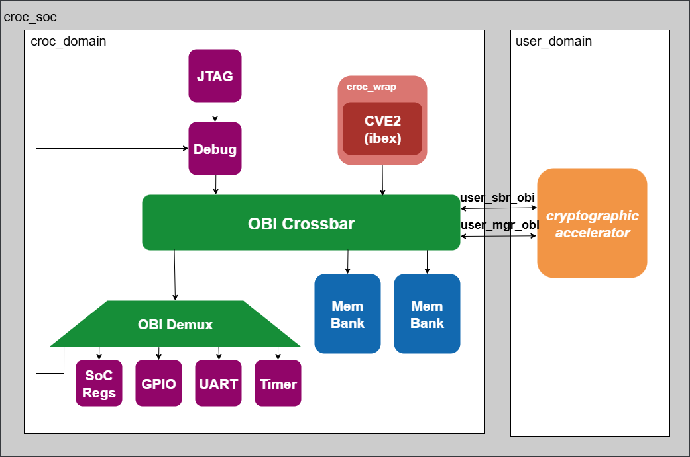
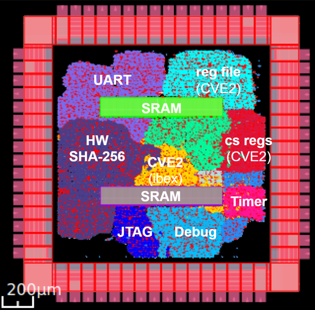
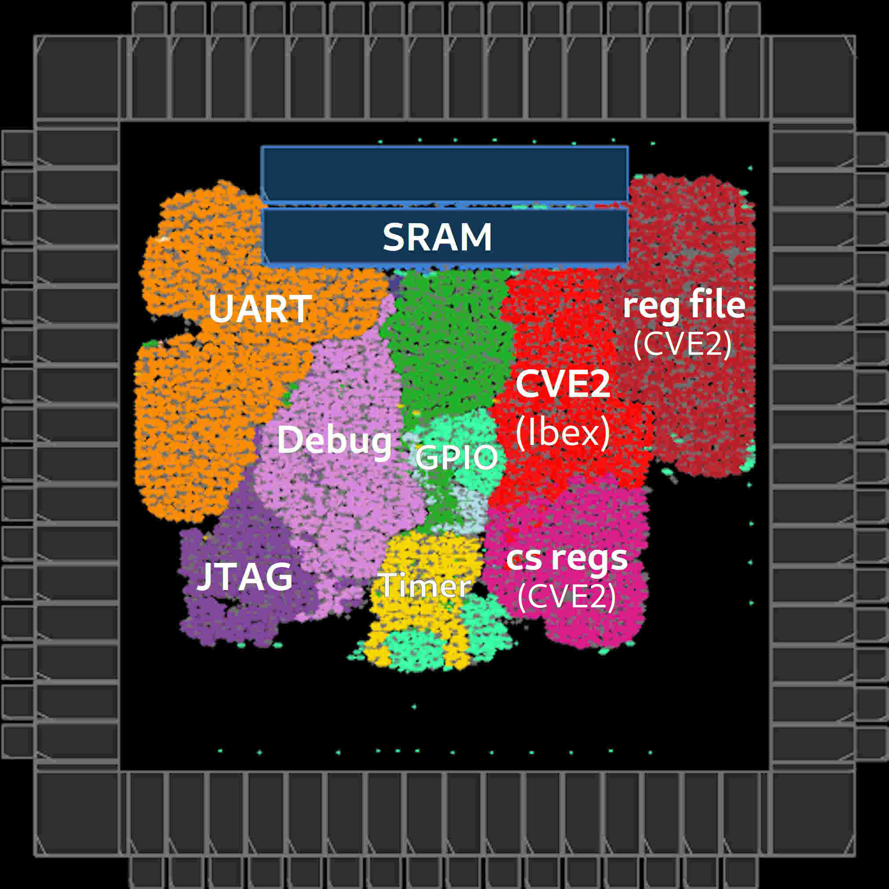

# Moloch

It is a SoC based on Croc (for more information: github.com/pulp-platform/croc), enhanced with a new feature: a hardware accelerator for SHA-256. This addition is particularly useful for ensuring data integrity, especially considering the increasing volume of sensitive data transmissions and the growing demand for heterogeneous System-on-Chips, which make the integration of a cryptographic accelerator for the Secure Hash Algorithm 256 (SHA-256) in Croc a good choice.

## Architecture

The main architectural difference compared to Croc is the cryptographic SHA-256 accelerator, which is not implemented in Croc. In Moloch, this accelerator is directly connected to the OBI bus, allowing efficient communication with CVE2, the RISC-V core of the SoC.

## Configuration

All RTL code for the hardware accelerator can be found in the `rtl/cryptographic_acc`  directory. The files `user_domain.sv` and `user_pkg.sv` were modified to integrate the accelerator with the OBI bus.

On the software side, two C programs are provided: `sw/testbencher_croc.c`, used to verify the functionality of the new hardware implementation, and `sw/SHA256.c`, which serves as a reference to compare performance and confirm the speedup achieved by the accelerator.

Finally, the file `openroad/floorplan.tcl` contains the necessary scripts for generating the physical implementation of the design.

## Results 

Moloch | Croc
:-----:|:-----:
 | 
              

| Result     | Description |
|------------|-------------|
| Speedup | Achieved **54× faster** than the software implementation on a RISC-V core |
| Frequency | Maintained system frequency with **no degradation** |
| Area | Area increase of **27 kGE** |

⚠️ **Note:** the software implementation in `SHA256.c` is not fully optimized; therefore, the reported speedup may be slightly lower in a fair comparison.

## License
Unless specified otherwise in the respective file headers, all code checked into this repository is made available under a permissive license. All hardware sources and tool scripts are licensed under the Solderpad Hardware License 0.51 (see `LICENSE.md`). All software sources are licensed under Apache 2.0.
